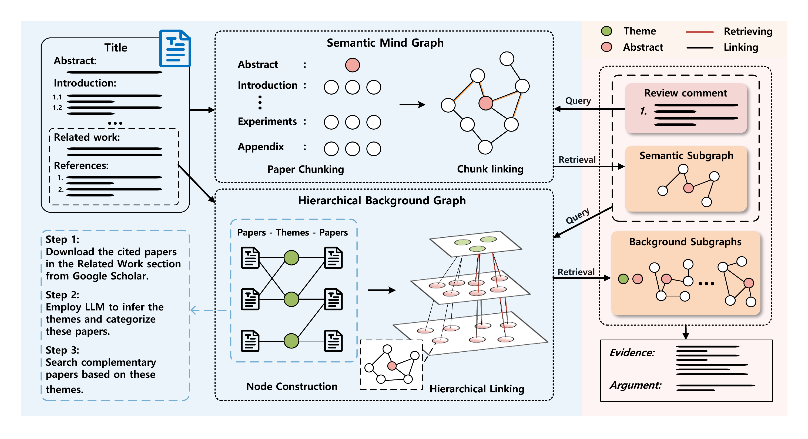
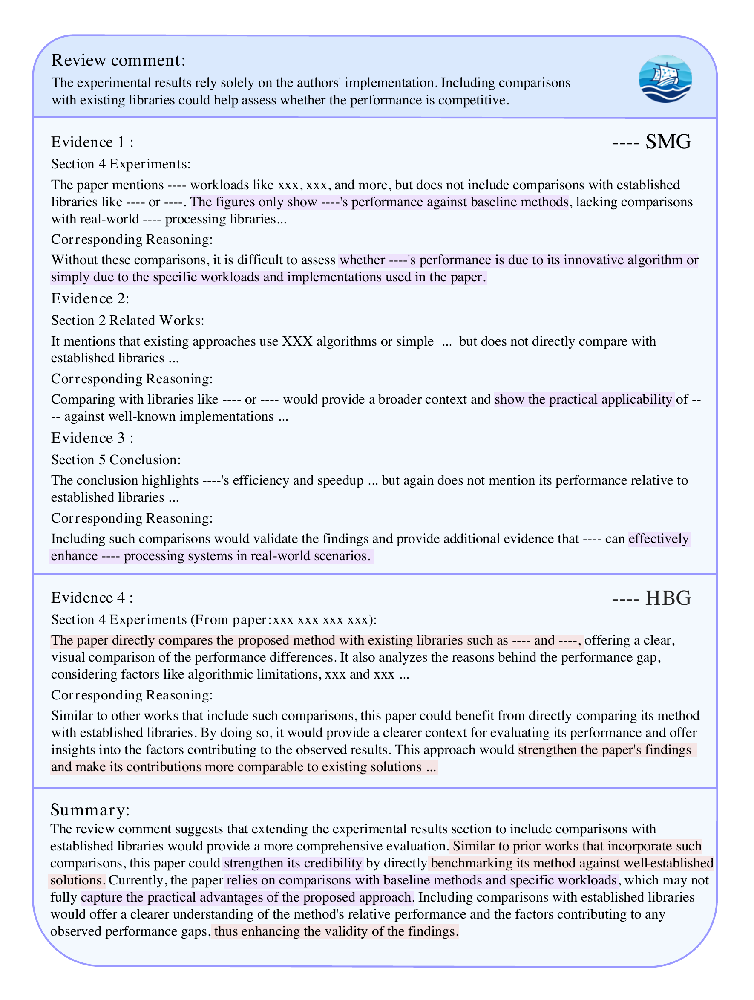
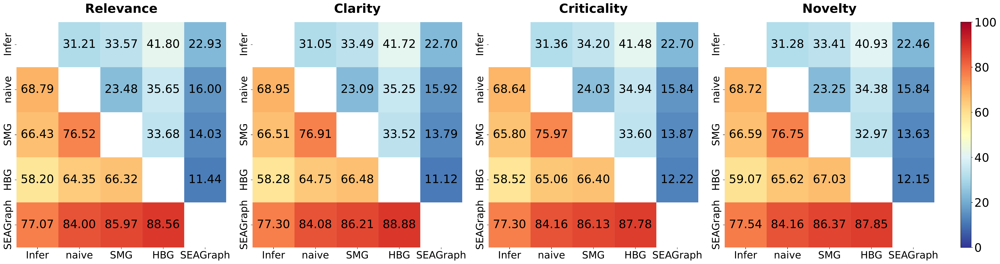

<div align="center">
  
  #   &nbsp; SEAGraph: Unveiling the Whole Story Behind Paper Review Comments
  
  ### *Because every review comment tells a deeper story...*
  
  [](https://arxiv.org/abs/2412.11939/) [](https://www.python.org/)   
  
</div>

---

## 🎯 What is SEAGraph?

Ever wondered what reviewers *really* mean when they write those cryptic comments on your paper? 🤔

**SEAGraph** is an intelligent framework that acts as your personal "review comment interpreter"! It doesn't just read review comments—it **unveils the underlying intentions, context, and research landscape** behind them.

<div align="center">
  
  <p><i>The SEAGraph Framework: Connecting the dots between papers, reviews, and research context</i></p>
</div>

### 🧠 How Does It Work?

SEAGraph constructs two powerful knowledge structures:

1. **📚 Semantic Mind Graph (SMG)**: Captures the author's thought process and the logical flow of the paper
2. **🌐 Hierarchical Background Graph (HBG)**: Maps out the research domains, related work, and academic context

By combining these graphs with intelligent retrieval, SEAGraph generates **coherent, context-aware explanations** that help you truly understand what reviewers are asking for!

<div align="center">
  
  <p><i>See SEAGraph in action: Transforming vague comments into actionable insights</i></p>
</div>

---

## 🚀 Quick Start

### Prerequisites

SEAGraph uses two separate environments due to dependency conflicts. Don't worry—we've got you covered! 

#### 🔬 Environment 1: For Nougat (PDF Parsing)

```bash
cuda==12.4
python==3.9.20
torch==2.5.1
transformers==4.38.2
nougat-ocr==0.1.17
numpy==2.0.2
```

#### 🤖 Environment 2: For Mistral & Sentence-BERT (Graph Construction & Retrieval)

```bash
cuda==12.4
python==3.9.20
torch==2.5.1
vllm==0.6.4.post1
transformers==4.46.3
sentence-transformers==3.3.1
torch_cluster==1.6.3
torch_scatter==2.1.2
torch_sparse==0.6.18
torch_spline_conv==1.2.2
```

> ⚠️ **Pro Tip**: The Nougat environment may conflict with the Mistral environment. Consider using separate conda/virtual environments!

---

## 📂 Project Structure

```
SEAGraph/
├── 📄 data/
│   ├── paper_pdf/      # 🎓 Place your academic papers here (PDF format)
│   └── raw_review/     # 📝 Place your review comments here (TXT format)
├── 💻 code/            # 🛠️ All the magic happens here
├── 📊 result/          # ✨ Your explanations will appear here (JSON format)
└── 🎨 asset/           # 🖼️ Figures and visualizations
```

---

## 🎬 The SEAGraph Pipeline

Transform your paper and review comments into insightful explanations in **10 easy steps**:

| Step | Script | Description | 
|------|--------|-------------|
| 1️⃣ | `pdf_parse.py` | 📖 Parse your PDF into machine-readable format (MMD) |
| 2️⃣ | `smg.py` | 🧠 Construct the Semantic Mind Graph |
| 3️⃣ | `review_process.py` | 🔍 Extract and process review comments |
| 4️⃣ | `hbg_related_paper_search.py` | 📚 Search for related papers based on citations |
| 5️⃣ | `hbg_themes_infer.py` | 🎯 Infer research themes and topics |
| 6️⃣ | `hbg_hot_paper_search.py` | 🔥 Find trending papers in your field |
| 7️⃣ | `hbg_process_paper.py` | ⚙️ Process all background papers |
| 8️⃣ | `retrieve_smg.py` | 🎣 Retrieve relevant content from SMG |
| 9️⃣ | `retrieve_hbg.py` | 🎣 Retrieve relevant content from HBG |
| 🔟 | `rag_seagraph.py` | 🎉 Generate comprehensive explanations! |

---

## 💡 Usage

It's as simple as running a single command! 

```bash
python <script_name>.py --filename <your_paper_id>
```

### Example: Process a Paper End-to-End

```bash
# Step 1: Parse the PDF
python pdf_parse.py --filename 5t44vPlv9x

# Step 2: Build the Semantic Mind Graph
python smg.py --filename 5t44vPlv9x

# Step 3: Process review comments
python review_process.py --filename 5t44vPlv9x

# ... continue with remaining steps ...

# Final step: Generate explanations
python rag_seagraph.py --filename 5t44vPlv9x
```

> 💡 **Tip**: Replace `5t44vPlv9x` with your paper's unique identifier!

---

## 📊 Performance Insights

<div align="center">
  
  <p><i>SEAGraph performance across different metrics</i></p>
</div>

---

## 🤝 Contributing

We welcome contributions! Whether it's:
- 🐛 Bug reports
- 💡 Feature suggestions  
- 📖 Documentation improvements
- 🔧 Code contributions

Feel free to open an issue or submit a pull request!

---

## 📜 Citation

If you find SEAGraph helpful in your research, please consider citing our work:

```bibtex
@article{yu2024seagraph,
  title={SEAGraph: Unveiling the Whole Story of Paper Review Comments},
  author={Yu, Jianxiang and Tan, Jiaqi and Ding, Zichen and Zhu, Jiapeng and Li, Jiahao and Cheng, Yao and Cui, Qier and Lan, Yunshi and Li, Xiang},
  journal={arXiv preprint arXiv:2412.11939},
  year={2024}
}
```

---

## 📧 Contact

Have questions? Reach out to us!

- 📮 Email: sea.ecnu@gmail.com
